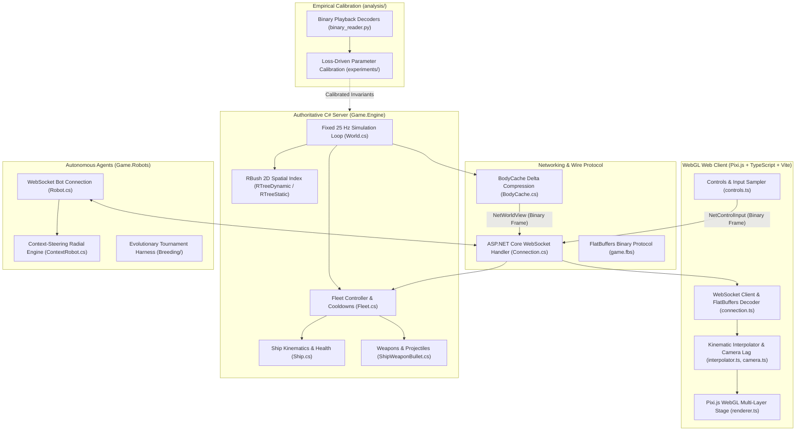

# Spaceone.io Remake

Authoritative C# simulation engine, Pixi.js WebGL client, and empirical kinematic calibration for the classic 2D multiplayer fleet combat game.

[](https://github.com/MichalRedm/spaceone-io-remake/actions/workflows/ci.yml)
[](https://dotnet.microsoft.com/)
[](https://pixijs.com/)
[](https://vitejs.dev/)
[](https://flatbuffers.dev/)
[](https://opensource.org/licenses/MIT)

<video src="https://github.com/user-attachments/assets/3673e589-83f6-4441-b4f6-311024a08ad0" controls autoplay loop muted playsinline style="max-width: 100%; border-radius: 8px;"></video>

[Overview](#overview) &bull; [Quickstart](#quickstart) &bull; [Controls](#controls--how-to-play) &bull; [Architecture](#system-architecture) &bull; [Subsystems](#core-subsystems) &bull; [Swarm Dynamics](#swarm-dynamics--fleet-steering) &bull; [Physics](#physics-calibration--empirical-kinematics) &bull; [Bots](#autonomous-bot-ai)

---

## Overview

**Spaceone.io** was a fast-paced 2D multiplayer arena game released in 2017 where players commanded expanding fleets of neon triangular spaceships. Fleets grow by collecting energy orbs across the arena, engage opponents with synchronized laser volleys, and execute high-speed boost maneuvers to evade incoming fire or cut off enemy formations.

This project reconstructs the original game as a modern, high-performance web platform:
- **Authoritative C# Backend**: A fixed-timestep 25 Hz simulation loop running on ASP.NET Core Kestrel WebSockets, based on the open-source [Daud.io](https://github.com/daud-io/daud) engine foundation.
- **Hardware-Accelerated WebGL Client**: A Pixi.js client bundled with Vite 5, featuring coordinate-mapped sprite atlases, multi-layered stage rendering, and inter-tick kinematic interpolation.
- **Zero-Copy FlatBuffers Wire Protocol**: High-frequency binary delta compression replacing high-overhead JSON serialization for real-time multiplayer updates.
- **Empirical Kinematic Calibration**: Physics models, projectile speeds, firing cooldowns, and boost envelopes reverse-engineered from 41 historical gameplay recordings containing over 3.8 million ship frames.

---

## Quickstart

### Prerequisites
- [.NET 7.0 SDK or newer](https://dotnet.microsoft.com/download)
- [Node.js](https://nodejs.org/) (v18, v20, or v22 LTS) and npm
- *(Optional)* [Python 3.10+](https://www.python.org/) for running kinematics analysis scripts

### 1. Build the Web Client
From the repository root, install dependencies and bundle the Pixi.js client:

```bash
cd Game.Engine/wwwroot
npm install
npm run build
cd ../..
```

*(For frontend development with hot module replacement, run `npm run dev` within `Game.Engine/wwwroot`.)*

### 2. Build and Launch the Game Server
Compile the solution and run the game server:

```bash
dotnet build Game.Engine.sln
dotnet run --project Game.Engine
```

### 3. Connect Locally
Open your web browser and navigate to:

```text
http://localhost:5000
```

### 4. Running Kinematic Tests & Verification
To verify codebase documentation links and validate analysis scripts:

```bash
# Verify codebase map references
python analysis/verify_codebase_map.py

# Check analysis scripts compilation
python -m py_compile analysis/core/*.py
```

---

## Controls & How to Play

Command your fleet using intuitive arcade controls:

- **Mouse Cursor**: Aims your fleet's direction. Your ships will naturally converge and flock towards the cursor.
- **Left Click (Hold)**: Fire synchronized laser volleys from all ships. Watch your weapon cooldowns.
- **Spacebar (Hold)**: Activate boost/dash. Engages the 3-phase kinematic acceleration envelope for rapid evasion or intercepts.

*Tip: Collect floating neon orbs to expand your fleet size and increase your overall firepower!*

---

## Engineering Challenges

Building a low-latency, real-time 2D multiplayer game in modern web environments presents several concrete systems challenges:

1. **Authoritative Simulation & Exploitation Prevention**: Client-side movement calculation invites speed and trajectory tampering. The server must maintain authoritative physics, integrating entity movement, collision responses, and shot cooldowns while keeping tick execution strictly bounded.
2. **GC Pause Mitigation in .NET**: At 25 Hz with hundreds of active ships, bullets, particles, and obstacles, object allocation on hot tick paths induces garbage collection pauses. The engine minimizes heap allocations by pooling buffers, reusing collections, and employing spatial bounding primitives.
3. **Bandwidth & Serialization Overhead**: Broadcasting world states to multiple concurrent WebSocket clients at 25 Hz can saturate network interfaces under text-based protocols. Delta compression (`BodyCache.cs`) paired with FlatBuffers binary frames minimizes packet payloads to only mutated, newly visible, or destroyed entities.
4. **Organic Swarm Cohesion Without Inter-Ship Overlap**: Simulating fleets of 1 to 100+ ships requires collision-free formation steering. Naive flocking models cause ships to oscillate or overlap; the remake implements Position-Based Dynamics (PBD) solid-disc relaxation with target ray convergence to preserve an organic swarm shape.

---

## System Architecture



---

## Core Subsystems

### 1. Authoritative Simulation & Spatial Partitioning
The game server executes a deterministic, fixed-rate tick loop at **25 Hz** ($\Delta t = 40.0\text{ ms}$), governed by `World.cs`:
- **Spatial Indexing (`RBush<Body>`)**: Broadphase collision detection relies on two distinct 2D R-Trees. `RTreeDynamic` is cleared and rebuilt every tick for active ships, bullets, and floating star orbs, while `RTreeStatic` indexes static arena obstacles and outer boundary lines. This bounds spatial collision queries to sub-millisecond execution times, bypassing $O(N^2)$ pairwise checks.
- **Actor Lifecycle**: Entities inherit from `ActorBody`, implementing discrete `Init`, `Think`, and `Destroy` hooks with explicit ownership chains (`Fleet` $\rightarrow$ `Ship` $\rightarrow$ `Bullet`).

### 2. Zero-Copy FlatBuffers Networking
Client-server communication uses binary FlatBuffers schemas (`game.fbs`) over WebSockets:
- **Delta Compression (`BodyCache.cs`)**: The server maintains a per-connection mirror of previously transmitted entity states. Each tick, it computes the symmetric difference—identifying newly spawned bodies (`NetBodyAdd`), updated kinematic states (`NetBodyUpdate`), and destroyed identifiers (`NetBodyDelete`).
- **Binary Zero-Copy Decoding**: The web client deserializes incoming `ArrayBuffer` payloads directly into FlatBuffers view accessors without allocating intermediary JavaScript objects.

### 3. WebGL Client Rendering & Interpolation
Rendered via Pixi.js inside `Game.Engine/wwwroot/src/`:
- **Inter-Tick Kinematic Interpolation (`interpolator.ts`)**: Because the server operates at 25 Hz while user monitors refresh at 60 Hz to 144 Hz+, the client maintains a sliding snapshot buffer. It evaluates position and angular velocity to perform smooth Hermite/linear interpolation and short-window extrapolation, eliminating visual stutter.
- **Dynamic Camera Lag (`camera.ts`)**: Camera tracking incorporates an exponential decay follower algorithm, giving fleets natural visual inertia without clipping the viewport boundaries.
- **Texture Atlas Mapping (`textureMap.ts`)**: Ships, bullets, laser flashes, and explosion sequences are sampled from packed sprite sheets preserving the exact visual coordinate frames from the original game assets.

---

## Swarm Dynamics & Fleet Steering

Commanding a fleet of dozens of individual ships requires collective movement dynamics that prevent inter-ship collisions while keeping the formation responsive to rapid cursor changes:

- **Position-Based Dynamics (PBD) Relaxation (`Flocking.cs`)**: Each ship is modeled with a solid core disc of diameter $D_{\text{solid}} = 25.0\text{ px}$. Over two iterative relaxation passes per tick, overlapping ship positions are pushed apart along their normal vectors with a stiffness factor $\alpha_{\text{push}} = 0.60$.
- **Target Ray Convergence**: Rather than flocking to a single point, each ship projects a convergence ray toward the cursor target offset by the fleet centroid: $\vec{T}_i = \text{AimTarget} + (\text{FleetCenter} - \vec{p}_i)$. This dynamic lateral compression elongates the fleet along its movement axis ($L/W$ ratio $1.1\times - 3.5\times$), matching original game behavior.
- **Unified Turn Direction Synchronization**: When a fleet executes a sharp turn ($|\Delta\theta| > 150^\circ$), subtle numerical asymmetries can cause half the fleet to sweep clockwise and the other counterclockwise, tearing the formation in two. The server enforces the authoritative fleet-level angular sign ($\text{sign}(\Delta\theta_{\text{fleet}})$) across all constituent ships, guaranteeing cohesive U-turns.
- **Collision Reduction**: Evaluated across 25-step turning rollouts, PBD relaxation reduced inter-ship overlap rates from $66.9\%$ (unconstrained baseline) and $29.0\%$ (standard Boids model) down to **$3.2\%$**.

---

## Physics Calibration & Empirical Kinematics

Rather than guessing physics constants, simulation parameters in `Hook.cs` are calibrated against **41 recorded WebSocket sessions** from the original game (`reference/space1-original/server-ansible/record/playback/`), encompassing over **3.8 million ship frames**, **413,000 food orbs**, and **112,000 laser shots**.

### Calibrated Invariants

| System Parameter | Calibrated Value / Formulation | Empirical Benchmark & Confidence |
| :--- | :--- | :--- |
| **Server Timestep ($\Delta t$)** | $40.0\text{ ms}$ ($25\text{ Hz}$) | Fixed frame intervals across all 41 playback sessions |
| **Firing Cooldown ($\tau_{\text{cd}}$)** | $K(N) = 13 + N - \lfloor \frac{N+4}{10} \rfloor \text{ ticks}$ | Verified across 4,467 firing cycles, 36,389 frames (**100.00% exact match**) |
| **Projectile Speed ($V_{\text{bullet}}$)** | $V(N) = 41.00 \cdot N^{-0.2633}\text{ px/tick}$ | Power-law fit across 27,127 bullet trajectories |
| **Max Turn Rate ($\omega_{\max}$)** | $0.1393\text{ rad/tick}$ ($199.5^\circ\text{/s}$) | Bounded angular agility during cruise |
| **Speed Dip Factor ($c_{\text{dip}}$)** | $0.4036$ (max $40.4\%$ speed loss on $180^\circ$ turn) | Trajectory curvature loss minimization |
| **Danger Zone Delay** | $3000\text{ ms}$ ($87\text{ ticks}$) latency before first decay | Measured across out-of-bounds events ($\mu = 3003\text{ ms}, \sigma = 33.3\text{ ms}$) |
| **Danger Zone Decay Rate** | $\Delta t(u) = \max(300\text{ ms}, 2000\text{ ms} - 1700\text{ ms} \cdot u)$ | Inverse linear depth function ($R^2 = 0.921$), FIFO order |

### 3-Phase Kinematic Boost Envelope
When activating dash/boost ($T_{\text{boost}} = 25\text{ ticks} = 1000\text{ ms}$), entities transition through three distinct phases:
1. **Surge Ramp ($0 - 160\text{ ms}$)**: Rapid acceleration from cruise velocity $V_{\text{cruise}}(N)$ up to peak velocity $V_{\text{peak}}(N) = 40.12 - 5.00 \cdot \ln(N)\text{ px/tick}$.
2. **Sustained Burn ($200 - 360\text{ ms}$)**: Plateau holding $0.77 \cdot V_{\text{peak}}(N)$ with active flame trail particles.
3. **Deceleration ($400 - 1000\text{ ms}$)**: Linear decay tapering back to normal cruise speed, with turn rate clamped to $\omega_{\max, \text{boost}} = 0.0497\text{ rad/tick}$ ($71.2^\circ\text{/s}$).

---

## Autonomous Bot AI

The `Game.Robots` assembly contains an autonomous agent framework for stress-testing server capacity and populating practice arenas:

- **Context-Steering Radials (`ContextRobot.cs`)**: Evaluates environmental stimuli onto a radial `ContextRing` composed of discrete angular buckets. Behaviors (`Advance`, `Dodge`, `Separation`, `StayInBounds`) write independent interest and danger vectors to the ring, which are resolved via vector blending into an optimal steering heading.
- **Utility-Based Strategy Switching (`HumanoidBot.cs`)**: Emulates human decision-making by scoring potential strategies (`EngageStrategy`, `CruisingStrategy`, `FleeStrategy`) based on relative fleet size, distance to arena borders, and shield health.
- **Genetic Algorithm Optimization (`Game.Robots/Breeding/`)**: Automates bot tuning via tournament-based genetic algorithms (`RobotEvolutionController.cs`). Behavior weights are treated as chromosomes; bots compete in isolated matches, scoring fitness on survival time, kill ratio, and damage output to iteratively breed superior steering profiles.

---

## Monorepo Layout

```text
spaceone-io-remake/
├── Game.Engine/                  # Authoritative ASP.NET Core game server
│   ├── Core/                     # 25 Hz simulation loop, RBush spatial index, World, Fleet, Ship
│   ├── Networking/               # WebSocket connections and BodyCache delta compression
│   └── wwwroot/                  # WebGL client (Pixi.js, TypeScript, Vite 5, SCSS)
│       └── src/                  # Client architecture (core, rendering, models, network, ui)
│
├── Game.API.Common/              # Shared data models, Hook physics configuration, FlatBuffers schemas
├── Game.API.Client/              # C# WebSocket client library for remote tooling and bots
├── Game.Robots/                  # Autonomous bots: context steering, humanoid strategies, genetic breeding
├── Game.Util/                    # Administrative CLI: server diagnostics, stress-testing, world controls
│
├── reference/                    # Reverse-engineering artifacts and historical data
│   └── space1-original/          # Original assets, WebAssembly client, decoders, and CSV telemetry
│
├── analysis/                     # Kinematic analysis scripts and loss-minimization benchmarks
│   ├── experiments/              # Isolated kinematic measurement harnesses (speed, cooldowns, flocking)
│   └── datasets/                 # Extracted telemetry trajectory profiles and benchmark results
│
└── .agents/                      # Deterministic agent governance, rules, and codebase map (AGENTS.md)
```

---

## AI-Augmented Engineering Governance & Contributing

This repository follows a structured engineering workflow documented in [`AGENTS.md`](./AGENTS.md) and [`.agents/`](./.agents/):
- **Deterministic Rule Routing**: Machine-readable path triggers route specific subsystems (backend physics, frontend WebGL, vector assets, kinematics analysis) to dedicated rule specifications.
- **5-Phase Operational Lifecycle**: All non-trivial modifications progress through sequential gates: *Rule Intake* $\rightarrow$ *Implementation* $\rightarrow$ *Local CI Verification* $\rightarrow$ *Context Self-Maintenance* $\rightarrow$ *Conventional Commits*.
- **Architectural Atlas**: An automated codebase map ([`.agents/context/codebase_map.md`](./.agents/context/codebase_map.md)) tracks symbols and invariants across all layers, verified continuously via `analysis/verify_codebase_map.py`.
- **Contributing**: If you wish to contribute, please refer to the workflow defined in [`AGENTS.md`](./AGENTS.md) to understand the local verification and PR creation process.

---

## Acknowledgments & Credits

- **Spaceone.io**: The original classic multiplayer game created in 2017.
- **[Daud.io](https://github.com/daud-io/daud)**: Open-source C# authoritative game engine foundation.
- **[space1-ansible](https://github.com/daud-io/space1-ansible)**: Reference reverse-engineering, packet decoding research, and recorded gameplay telemetry logs.

---

## License

This project is open-source under the [MIT License](https://opensource.org/licenses/MIT).

